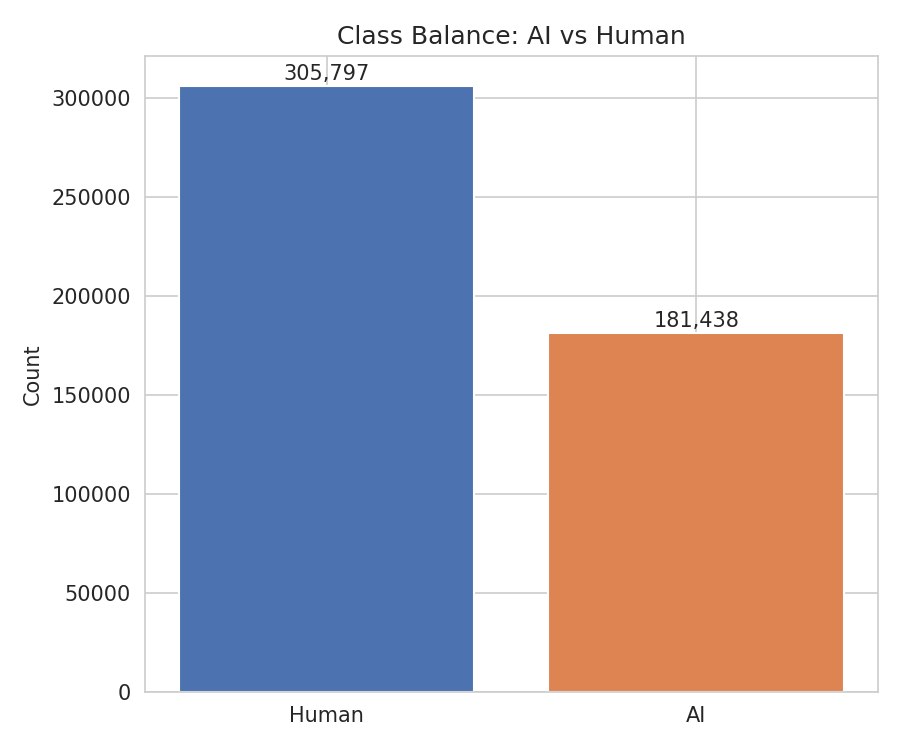
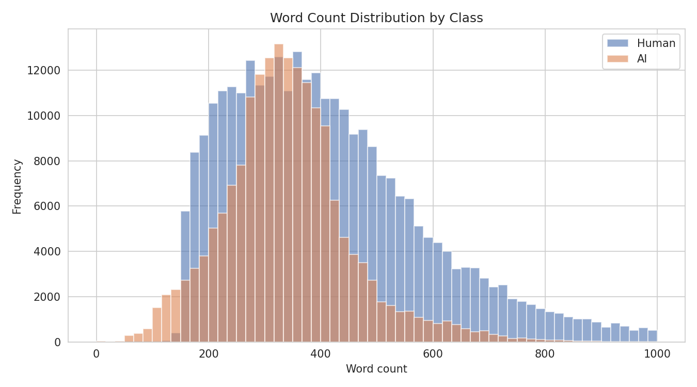
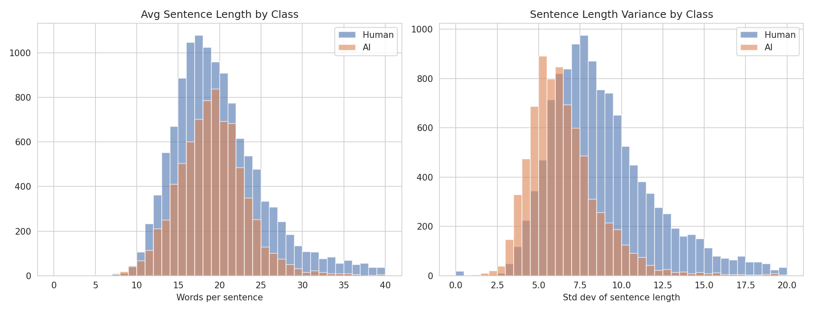
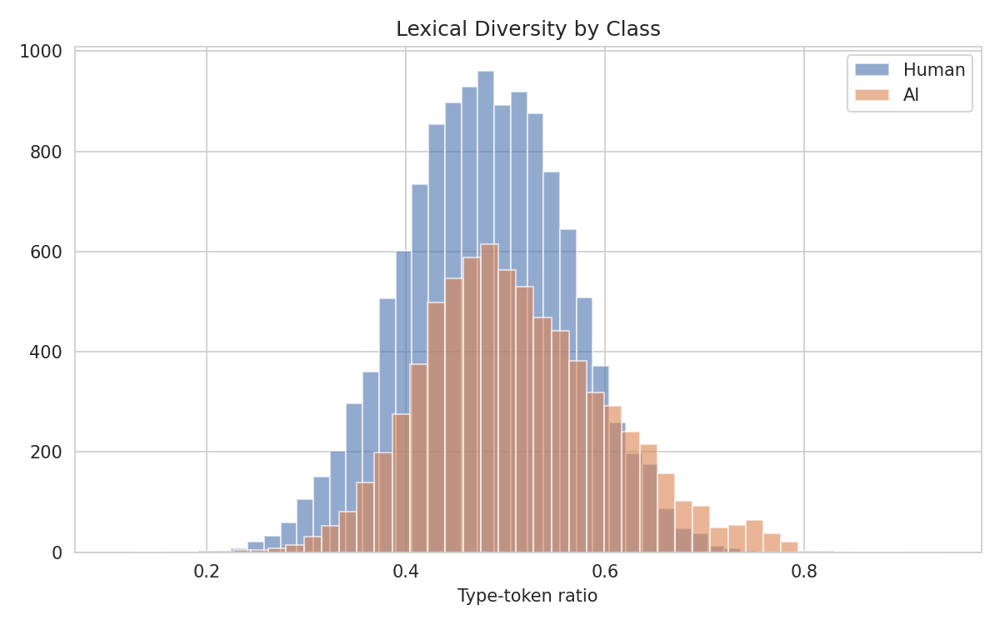
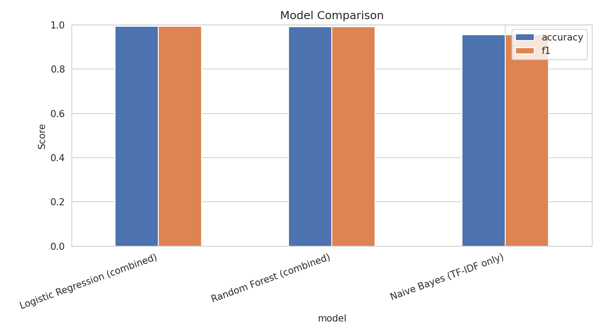
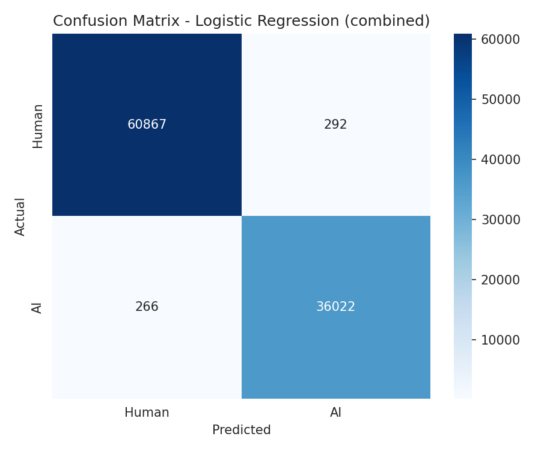
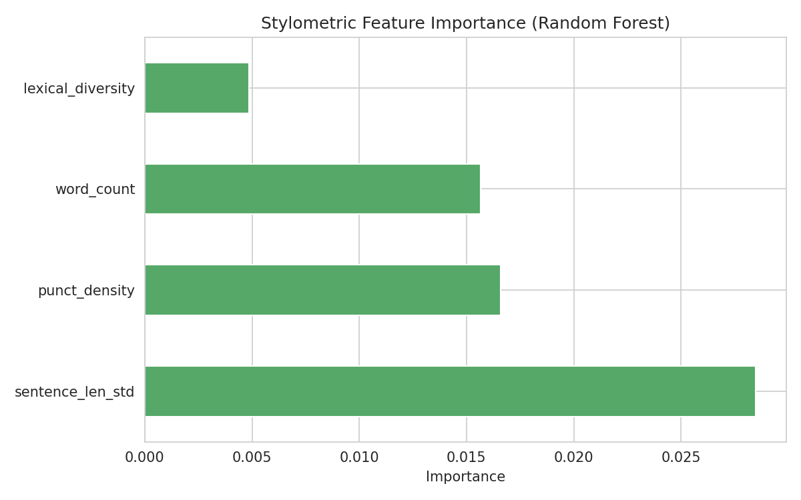

# Authenticity — AI vs Human Text Detector

A classic machine learning pipeline that tells human-written text from AI-generated text — scoring writing style, not just word choice — compared across three genuinely different algorithm families.

## 🚀 Live App

[ai-human-text-detection.streamlit.app](https://ai-human-text-detection.streamlit.app/)

## Problem

With AI writing tools everywhere, being able to tell human-written text from AI-generated text has real value — academic integrity, content authenticity, editorial review. This project builds that classifier using **classic ML** (no transformers, no deep learning), and — per the assignment requirement — compares three genuinely different algorithm families rather than three variations on the same idea.

## Dataset

- **Source**: [AI vs Human Text](https://www.kaggle.com/datasets/shanegerami/ai-vs-human-text) (Kaggle)
- **Size**: 487,235 essays after cleaning (from ~500K raw), labeled human or AI-generated
- **Class balance**: 62.8% human, 37.2% AI

The raw CSV (1.1GB+) isn't included in this repo — download it directly from the Kaggle link above if you want to reproduce training.

### Data Cleaning

- Dropped duplicate and null rows
- No further cleaning needed — the dataset ships pre-labeled and pre-cleaned relative to most real-world scraped text

## Exploratory Analysis

Before building any features, EDA checked whether AI and human text actually differ in measurable ways — and whether any of those differences were genuine style signals versus dataset-specific shortcuts.

| Signal | Finding |
|---|---|
| Word count | Human text has a much longer tail (many run 600–1,000+ words); AI text clusters shorter. Real signal, but flagged as a partial shortcut — this dataset's AI outputs run shorter, which may not generalize to other AI tools. |
| Sentence length variance | **Strongest genuine stylometric signal.** AI sentences cluster tightly at low variance; human sentences spread much wider — a real, uniform-vs-varied writing rhythm difference. |
| Average sentence length | Nearly identical between classes — dropped as a feature. |
| Lexical diversity | Weak but real difference — kept as a minor feature. |
| Punctuation density | Mild difference — kept as a minor feature. |






## Feature Engineering

**Stylometric features (4, kept from EDA):**
- `word_count` — total words
- `sentence_len_std` — standard deviation of sentence length (words per sentence)
- `lexical_diversity` — unique words / total words
- `punct_density` — punctuation character count / word count

**Word content:** TF-IDF (unigrams + bigrams, 5,000 features, English stop words removed)

## Three Genuinely Different Algorithms

| Model | Family | Features Used | Accuracy | F1 |
|---|---|---|---|---|
| **Logistic Regression** | Linear | TF-IDF + stylometric | **99.36%** | **99.36%** |
| Random Forest | Tree ensemble | TF-IDF + stylometric | 99.15% | 99.15% |
| Naive Bayes | Probabilistic | TF-IDF only | 95.47% | 95.45% |

Full comparison: [`table_model_comparison.csv`](table_model_comparison.csv)

**Why Naive Bayes only gets TF-IDF**: Multinomial Naive Bayes assumes non-negative, count-like input. The scaled, centered stylometric features (some negative after standardization) don't fit that assumption, so Naive Bayes trains on word content alone while Logistic Regression and Random Forest use the combined feature set.




625 errors out of 97,447 test rows, roughly balanced in both directions.

## Feature Importance



Full breakdown: [`table_style_feature_importance.csv`](table_style_feature_importance.csv)

`sentence_len_std` ranks highest — confirming the EDA finding before any model was trained. `word_count` ranks second, which is the honest caveat: part of what the model learned is genuinely about sentence rhythm, and part of it is this dataset's AI outputs tending to run shorter — a dataset-specific shortcut rather than pure style detection.

## Key Engineering Decisions

- **Why these four stylometric features**: EDA tested six candidates. Average sentence length barely differed between classes and was dropped; the other four showed real separation.
- **Why `class_weight='balanced'`**: the 62.8%/37.2% split isn't severe, but enough to bias a model toward the majority class without correction.
- **Why TF-IDF is capped at 5,000 features**: a larger vocabulary would help Naive Bayes, but Random Forest gets slow and memory-heavy on very high-dimensional sparse input. 5,000 keeps every model trainable on the same feature set within a normal Colab session.

## Honest Limitations

- **Shortcut risk**: `word_count`'s strength as a feature is partly a dataset artifact (this dataset's AI text runs shorter), not purely a style signal.
- **Single dataset**: trained and tested on one AI vs Human Text dataset. A different AI model family, prompt style, or writing domain could shift these numbers in either direction. Tested informally against a professional bio (a genre the model never saw in training) — it misclassified it, which is expected domain-shift behavior, not a broken model.
- **Simple sentence splitting**: sentence boundaries use a basic regex on `. ! ?`, not a proper NLP sentence tokenizer — abbreviations and edge cases can slightly skew the sentence-length features.

## App Features

- **Try it**: paste any text, get a real-time prediction from all three trained models side by side, plus the computed stylometric feature values for that text
- **Model performance**: all EDA and evaluation charts, live metrics
- **Model & method**: full pipeline walkthrough, algorithm comparison table, engineering decisions, and the limitations above

## Usage

```python
import joblib
import re
import numpy as np
import pandas as pd
from scipy.sparse import hstack, csr_matrix

nb_model = joblib.load('nb_model.pkl')
lr_model = joblib.load('lr_model.pkl')
rf_model = joblib.load('rf_model.pkl')
tfidf_vectorizer = joblib.load('tfidf_vectorizer.pkl')
style_scaler = joblib.load('style_scaler.pkl')

# see app.py for the full feature-engineering + classify_text() implementation
```

## Repository

[github.com/MaryumAkram16/AI-Human-Text-Detector](https://github.com/MaryumAkram16/AI-Human-Text-Detector)

## Tech Stack

- `scikit-learn` — TF-IDF, MultinomialNB, LogisticRegression, RandomForestClassifier
- `polars` — lazy CSV loading and EDA on the 487K-row dataset
- `pandas` / `numpy` — feature engineering
- `matplotlib` / `seaborn` — visualization
- `streamlit` — deployed app interface
- `joblib` — model persistence

## Possible Next Steps

- Expand training data beyond essays into other genres (professional bios, articles, social posts) to reduce the domain-shift limitation
- Replace the basic regex sentence splitter with a proper NLP tokenizer (e.g. spaCy or NLTK's `sent_tokenize`) for more accurate sentence-length features
- Test against text from newer/different AI models to see how well the current model generalizes beyond its training distribution
